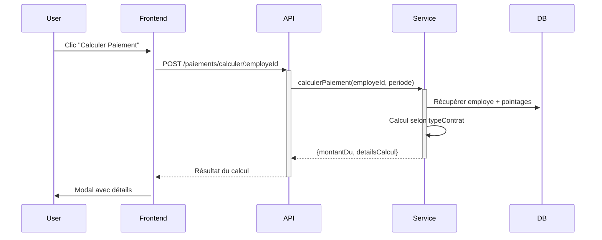
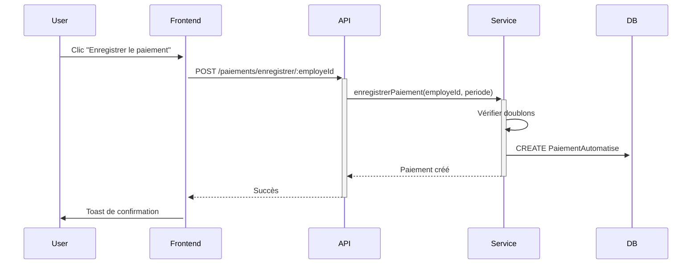
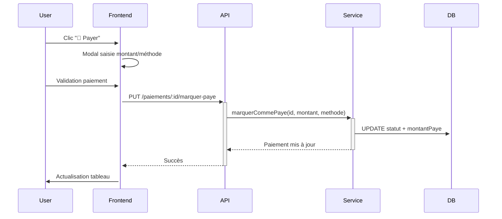

# 💰 Système de Paiements Automatisés Basé sur les Pointages

## 📋 Vue d'ensemble

Ce système calcule automatiquement les paiements des employés en fonction de leurs pointages (arrivée/départ/absences) selon trois types de contrats :

- **🏢 JOURNALIER** : Paiement basé sur le nombre de jours travaillés
- **⏰ HONORAIRE** : Paiement basé sur le nombre d'heures travaillées  
- **💼 FIXE** : Salaire fixe avec déduction des absences

## 🏗️ Architecture Technique

### Backend (Node.js + Express + Prisma + MySQL)

#### 1. **Base de données** - `prisma/schema.prisma`
```prisma
model PaiementAutomatise {
  id              Int      @id @default(autoincrement())
  periode         String   // "2024-10" 
  montantDu       Float    // Montant calculé
  montantPaye     Float    @default(0) // Montant payé
  typeContrat     TypeContrat
  detailsCalcul   Json     // Détails du calcul
  statut          StatutPaiementAutomatise @default(CALCULE)
  // Relations avec Employe et Entreprise
}
```

#### 2. **Service Principal** - `src/services/paiementAutomatise.service.ts`
```typescript
class PaiementAutomatiseService {
  // Calcul selon le type de contrat
  async calculerPaiement(employeId: number, periode: string)
  
  // Types de calculs spécialisés
  private calculerPaiementJournalier(employe, pointages, periode)
  private calculerPaiementHonoraire(employe, pointages, periode) 
  private calculerPaiementFixe(employe, pointages, periode)
  
  // Gestion des paiements
  async enregistrerPaiement(employeId: number, periode: string)
  async marquerCommePaye(paiementId, montant, methode, notes)
}
```

#### 3. **Logiques de Calcul**

##### **📅 JOURNALIER**
```javascript
// Compter les jours de présence selon les pointages
joursTravailes = pointages.filter(p => p.statut === 'PRESENT' || p.statut === 'RETARD').length
montantDu = tauxJournalier × joursTravailes

// Exemple: 25 000 FCFA/jour × 22 jours = 550 000 FCFA
```

##### **⏱️ HONORAIRE** 
```javascript
// Calculer les heures travaillées
for (pointage of pointages) {
  if (pointage.heureArrivee && pointage.heureDepart) {
    heures += (heureDepart - heureArrivee) / (1000 * 60 * 60)
  }
}
montantDu = tauxHoraire × heuresTravailes

// Exemple: 5 000 FCFA/h × 176h = 880 000 FCFA
```

##### **💰 FIXE**
```javascript
// Calculer les déductions d'absences
joursOuvrables = calculerJoursOuvrables(annee, mois) // Exclut weekends
joursAbsents = pointages.filter(p => p.statut === 'ABSENT').length
deduction = (salaireFixe / joursOuvrables) × joursAbsents
montantDu = salaireFixe - deduction

// Exemple: 800 000 FCFA - (800 000/22 × 3 absences) = 690 909 FCFA
```

#### 4. **API Endpoints**

```http
POST   /api/paiements/calculer/:employeId
POST   /api/paiements/enregistrer/:employeId
GET    /api/entreprises/:id/paiements-automatises?periode=2024-10
GET    /api/paiements/:paiementId
PUT    /api/paiements/:paiementId/marquer-paye
```

### Frontend (React + Tailwind + Framer Motion)

#### 1. **Service Frontend** - `paiementAutomatise.service.js`
```javascript
class PaiementAutomatiseService {
  async calculerPaiement(employeId, periode)
  async enregistrerPaiement(employeId, periode)
  async obtenirPaiementsEntreprise(entrepriseId, periode)
  async marquerCommePaye(paiementId, montant, methode, notes)
  
  // Utilitaires
  genererPeriodeActuelle() // "2024-10"
  formaterMontant(montant) // "500 000 FCFA"
  calculerPourcentagePaye(montantPaye, montantDu)
}
```

#### 2. **Composants Principaux**

##### **🧮 ModalCalculerPaiement.jsx**
- Interface pour sélectionner la période
- Affichage du calcul détaillé selon le type de contrat
- Boutons "Calculer" et "Enregistrer le paiement"

##### **📊 HistoriquePaiementsPage.jsx** 
- Tableau des paiements avec filtres par période
- Statistiques (total dû, payé, reste à payer)
- Actions : voir détails, enregistrer paiement

##### **👥 EmployesPage.jsx** (modifié)
- Nouveau bouton "💰 Calculer Paiement" dans les actions
- Disponible uniquement pour les employés actifs

## 🔄 Flux Fonctionnel Complet

### 1. **Calcul d'un Paiement**


### 2. **Enregistrement d'un Paiement**


### 3. **Marquage comme Payé**


## 📊 Exemples de Calculs Détaillés

### **Exemple 1 : Employé Journalier**
```json
{
  "employe": {
    "nom": "Mamadou Diallo",
    "typeContrat": "JOURNALIER", 
    "tauxJournalier": 25000
  },
  "pointages": [
    {"date": "2024-10-01", "statut": "PRESENT"},
    {"date": "2024-10-02", "statut": "PRESENT"},
    {"date": "2024-10-03", "statut": "ABSENT"},
    {"date": "2024-10-04", "statut": "RETARD"}
    // ... 22 jours ouvrables
  ],
  "calcul": {
    "joursTravailes": 20,
    "joursAbsents": 2, 
    "montantBrut": "25 000 × 20 = 500 000 FCFA"
  }
}
```

### **Exemple 2 : Employé Honoraire**
```json
{
  "employe": {
    "nom": "Aissatou Ba",
    "typeContrat": "HONORAIRE",
    "tauxHoraire": 5000
  },
  "pointages": [
    {
      "date": "2024-10-01",
      "heureArrivee": "08:00",
      "heureDepart": "17:00",
      "heuresTravailes": 8
    }
    // ... autres jours
  ],
  "calcul": {
    "heuresTravailes": 176,
    "montantBrut": "5 000 × 176h = 880 000 FCFA"
  }
}
```

### **Exemple 3 : Employé Fixe**
```json
{
  "employe": {
    "nom": "Cheikh Gueye", 
    "typeContrat": "FIXE",
    "salaireFixe": 800000
  },
  "pointages": [
    {"date": "2024-10-01", "statut": "PRESENT"},
    {"date": "2024-10-02", "statut": "ABSENT"},
    {"date": "2024-10-03", "statut": "ABSENT"}
    // ... 22 jours ouvrables
  ],
  "calcul": {
    "salaireFixe": 800000,
    "joursOuvrables": 22,
    "joursAbsents": 2,
    "deductionAbsences": "(800 000 ÷ 22) × 2 = 72 727 FCFA",
    "montantNet": "800 000 - 72 727 = 727 273 FCFA"
  }
}
```

## 🚀 Installation et Déploiement

### **1. Backend**
```bash
# Ajouter le modèle à la base de données
npx prisma generate
npx prisma db push

# Démarrer le serveur
npm run dev
```

### **2. Frontend**
```bash
cd frontend/gestion-salaire
npm run dev
```

### **3. Tests**
```bash
# Tester les API
./test-paiements-auto.sh

# Résultat attendu:
# ✅ Calcul de paiement
# ✅ Enregistrement de paiement  
# ✅ Récupération des paiements
# ✅ Marquage comme payé
# ✅ Gestion des erreurs
```

## 🎯 Utilisation Pratique

### **Workflow Admin/Caissier :**

1. **📊 Tableau de bord** → Voir les employés actifs
2. **👤 Page Employés** → Cliquer "💰 Calculer Paiement" 
3. **🧮 Modal Calcul** → Sélectionner période → "Calculer"
4. **✅ Validation** → Vérifier détails → "Enregistrer le paiement"
5. **📋 Historique** → Voir tous les paiements → "💸 Payer"
6. **💳 Paiement** → Saisir montant + méthode → "Enregistrer"

### **Avantages :**

- ✅ **Automatisation** : Plus de calculs manuels
- ✅ **Précision** : Basé sur les pointages réels  
- ✅ **Traçabilité** : Historique complet des paiements
- ✅ **Flexibilité** : Support de 3 types de contrats
- ✅ **Paiements partiels** : Possibilité de payer en plusieurs fois

## 🔧 Configuration et Personnalisation

### **Paramètres modifiables :**

```javascript
// Nombre de jours ouvrables par défaut (hors weekends)
calculerJoursOuvrables(annee, mois)

// Heures par défaut si pas de pointage de départ
const HEURES_PAR_DEFAUT = 8;

// Périodes disponibles dans les sélecteurs  
genererListePeriodes(6) // 6 derniers mois
```

### **Méthodes de paiement supportées :**
- 💵 Espèces
- 🏦 Virement Bancaire  
- 📱 Orange Money
- 💳 Wave
- ❓ Autre

## 📈 Métriques et Reporting

### **Statistiques disponibles :**
- Nombre total de paiements
- Montant total dû
- Montant total payé
- Reste à payer
- Répartition par type de contrat
- Évolution mensuelle

### **Exportation :**
```javascript
// Future fonctionnalité : Export Excel/PDF
exporterHistoriquePaiements(entrepriseId, periode)
```

## 🛡️ Sécurité et Validations

### **Contrôles Backend :**
- ✅ Authentification requise pour tous les endpoints
- ✅ Vérification des droits d'accès à l'entreprise  
- ✅ Validation des données avec Zod
- ✅ Protection contre les doublons (unique par employé/période)
- ✅ Validation des montants (positifs, limites)

### **Contrôles Frontend :**
- ✅ Gestion des états de chargement
- ✅ Messages d'erreur informatifs
- ✅ Validation des formulaires
- ✅ Confirmation des actions importantes

## 🐛 Dépannage

### **Erreurs courantes :**

1. **"Employé non trouvé"** → Vérifier l'ID employé
2. **"Paiement existe déjà"** → Un paiement pour cette période existe
3. **"Token invalide"** → Se reconnecter
4. **"Entreprise non trouvée"** → Vérifier les droits d'accès

### **Logs de débogage :**
```bash
# Voir les logs du serveur
tail -f logs/app.log

# Logs des requêtes SQL
DEBUG=prisma:query npm run dev
```

---

## 📞 Support

Pour toute question ou problème :
- 📧 Email : support@techniplus.sn  
- 🐛 Issues : Créer une issue GitHub
- 📖 Documentation : `/docs` du projet

**🎉 Le système de paiements automatisés est maintenant prêt à être utilisé !**