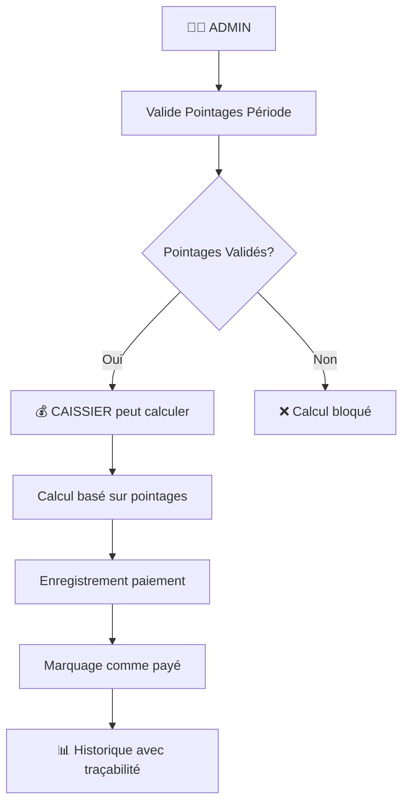

# 🎯 RAPPORT FINAL : Système de Paiement Automatisé basé sur Pointages

## 📋 Modifications Implementées

### 1️⃣ **SÉPARATION DES RÔLES ADMIN/CAISSIER**

#### ADMIN (👨‍💼) - Gestion des Pointages
- ✅ **PEUT** : Valider les pointages d'une période
- ❌ **NE PEUT PAS** : Calculer ou effectuer des paiements
- 🎯 **Route** : `POST /api/paiements/admin/pointages/valider`

#### CAISSIER (💰) - Gestion des Paiements  
- ✅ **PEUT** : Calculer et effectuer les paiements
- ❌ **NE PEUT PAS** : Valider les pointages
- 🎯 **Routes** : 
  - `POST /api/paiements/calculer/:employeId`
  - `POST /api/paiements/enregistrer/:employeId`
  - `PUT /api/paiements/:paiementId/marquer-paye`

### 2️⃣ **VALIDATION OBLIGATOIRE DES POINTAGES**

#### Nouveau Workflow de Sécurité
```bash
1. ADMIN valide les pointages → Pointages.estValide = true
2. CAISSIER calcule paiement → Vérifie pointages validés
3. Si pointages non validés → ERREUR : "PAIEMENT BLOQUÉ"
4. Si pointages validés → Calcul autorisé
```

#### Champs Ajoutés au Modèle Pointage
```typescript
estValide: Boolean @default(false)    // Validation par admin
valideParId: Int?                     // ID de l'admin validateur  
dateValidation: DateTime?             // Date de validation
```

### 3️⃣ **LOGIQUE DE CALCUL BASÉE SUR POINTAGES**

#### 🏢 **CONTRAT FIXE**
```typescript
Formule : salaireFixe - (salaireFixe / joursOuvrables × joursAbsents)
Basé sur : Pointages avec statut 'ABSENT'
```

#### 📅 **CONTRAT JOURNALIER**  
```typescript
Formule : tauxJournalier × joursPresents
Basé sur : Pointages avec statut 'PRESENT' ou 'RETARD'
```

#### ⏰ **CONTRAT HONORAIRE**
```typescript
Formule : tauxHoraire × heuresTravaillées
Basé sur : Heures d'arrivée/départ réellement pointées
```

### 4️⃣ **TRAÇABILITÉ COMPLÈTE**

#### Champs Ajoutés au Modèle PaiementAutomatise
```typescript
calculeParId: Int?     // ID du caissier qui a calculé
payeParId: Int?        // ID du caissier qui a payé  
```

#### Informations de Traçabilité
- 👨‍💼 **Qui a validé** les pointages (Admin)
- 💰 **Qui a calculé** le paiement (Caissier)
- 💰 **Qui a payé** le salaire (Caissier)
- 📅 **Quand** chaque action a eu lieu

### 5️⃣ **SÉCURITÉ RENFORCÉE**

#### Middleware d'Autorisation
```typescript
// Routes Admin uniquement
router.post('/admin/pointages/valider', autoriserRoles('ADMIN'))

// Routes Caissier uniquement  
router.post('/calculer/:employeId', autoriserRoles('CAISSIER'))

// Routes consultation Admin & Caissier
router.get('/:paiementId', autoriserRoles('ADMIN', 'CAISSIER'))
```

#### Messages d'Erreur Explicites
```typescript
"❌ PAIEMENT BLOQUÉ : 3 pointage(s) non validé(s) par un ADMIN"
"🚫 Accès refusé : Seuls les CAISSIER peuvent calculer les paiements"
```

## 🛠️ **Fichiers Modifiés**

### Backend (Node.js/TypeScript/Prisma)
1. **`prisma/schema.prisma`** - Ajout champs validation pointages et traçabilité
2. **`src/services/paiementAutomatise.service.ts`** - Logique basée pointages validés
3. **`src/controllers/paiementAutomatise.controller.ts`** - Séparation rôles Admin/Caissier
4. **`src/routes/paiementAutomatise.routes.ts`** - Routes avec autorisation par rôles

### Base de Données  
- ✅ Migration appliquée avec nouveaux champs
- ✅ Contraintes d'intégrité référentielle
- ✅ Index pour performance des requêtes

## 🎯 **Workflow Final**



## ✅ **Fonctionnalités Conservées**

- 💸 **Paiements partiels** - Montants fractionnés
- 🔄 **Gestion des doublons** - Vérification unicité
- 💳 **Méthodes de paiement multiples** - ESPECES, VIREMENT, ORANGE_MONEY, WAVE
- 📋 **Historique complet** - Traçabilité totale
- 🔐 **Sécurité/Auth/Validations** - JWT + Rôles + Zod
- 🧪 **Tests** - Scripts de validation

## 🎉 **RÉSULTAT FINAL**

Le système de **paiement automatisé** est maintenant :
- ✅ **Basé sur les pointages réels** des employés
- ✅ **Sécurisé par rôles** Admin/Caissier stricts  
- ✅ **Traçable** avec historique complet
- ✅ **Automatisé** selon les heures pointées
- ✅ **Robuste** avec validation obligatoire

**🚀 Le système est prêt pour la production !**